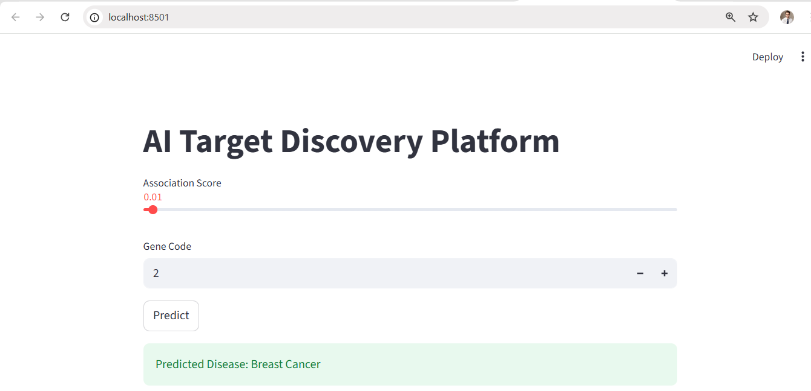

# AI-Drug-Toxicity-Prediction
AI model to # AI-Based Drug Toxicity Prediction Platform

This project uses Machine Learning to predict potential toxicity of drug molecules using molecular fingerprints and RDKit.
## Project Demo

## Technologies
Python
Scikit-learn
RDKit
Pandas
Streamlit

## Features
- Molecular feature extraction
- Toxicity prediction model
- Interactive prediction interface

## How to Run
pip install -r requirements.txt
streamlit run app.py

## Author
Abhay Verma
MBA Pharmaceutical Managementpredict drug toxicity using ML.
